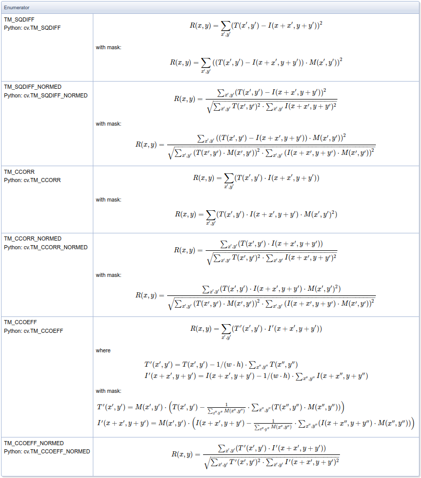

# Template-Matching using OpenCV
 A template matching program I developed using OpenCV.

## Introduction

Template matching is one of the simplest form of object detection, where it simply scans a larger image for a provided template by sliding the template target image across the larger image. 

According to [OpenCV Documentation](https://docs.opencv.org/4.x/d4/dc6/tutorial_py_template_matching.html), *"It simply slides the template image over the input image (as in 2D convolution) and compares the template and patch of input image under the template image."*
It is important to keep in mind that this will only work with a "perfect match" while using correlation.

For this project, it was utilized a very "messy" image which contains a lot of information just to see if it somehow will get any adicional dificculty for the algorithm to correctly match the template.


And the template is gonna be a little chunck of the full image that contains a screwdriver on it:


Also, here in this project I'll be using six different methods in order to better visualize which one performs better in this case.

The six methods are:



In Python3, they can be applied using the following code:

```
# All the 6 methods for comparison in a list
# At first, I'll be using strings, but later on the eval() function will be used in order to convert to function
methods = ['cv2.TM_CCOEFF', 'cv2.TM_CCOEFF_NORMED', 'cv2.TM_CCORR','cv2.TM_CCORR_NORMED', 'cv2.TM_SQDIFF', 'cv2.TM_SQDIFF_NORMED']

for m in methods:
    
    # Create a copy of the image
    full_copy = full_img.copy()
    
    # Get the actual function instead of the string
    method = eval(m)

    # Apply template Matching with the method
    res = cv2.matchTemplate(full_copy,screwdriver,method)
    
    # Grab the Max and Min values, plus their locations
    min_val, max_val, min_loc, max_loc = cv2.minMaxLoc(res)
    
    # Set up drawing of Rectangle
    
    # If the method is TM_SQDIFF or TM_SQDIFF_NORMED, take minimum
    # Notice the coloring on the last 2 left hand side images.
    if method in [cv2.TM_SQDIFF, cv2.TM_SQDIFF_NORMED]:
        top_left = min_loc    
    else:
        top_left = max_loc
        
    # Assign the Bottom Right of the rectangle
    bottom_right = (top_left[0] + width, top_left[1] + height)

    # Draw the Red Rectangle
    cv2.rectangle(full_copy,top_left, bottom_right, 255, 10)

    # Plot the Images
    plt.subplot(121)
    plt.imshow(res)
    plt.title('Result of Template Matching')
    
    plt.subplot(122)
    plt.imshow(full_copy)
    plt.title('Detected Point')
    
    plt.suptitle(m, y=0.75)
    
    plt.show()
    plt.savefig(m + 'method.png')
```

---

## Results

And these are the results for all the six tested methods:


As it is possible to notice, except for the CCORR model, all the methods successfully matched the template with the full image!

Its important to notice that the result image is basically a heat map (correlation map), where the highest point is the matching point between the image and the template. This happens because once we correlate the filter(template) with the image, when the filter lands right on the spot of the image it was taken from, we get the maximum value and thus the "hottest" point on the heat map.


## NEXT STEPS

Learn more about the theory behind the different methods and why only the CCORR model couldn't detect the template correctly, while the CCORR NORMED model could. More information at [OpenCV Documentation](https://docs.opencv.org/4.x/d4/dc6/tutorial_py_template_matching.html).